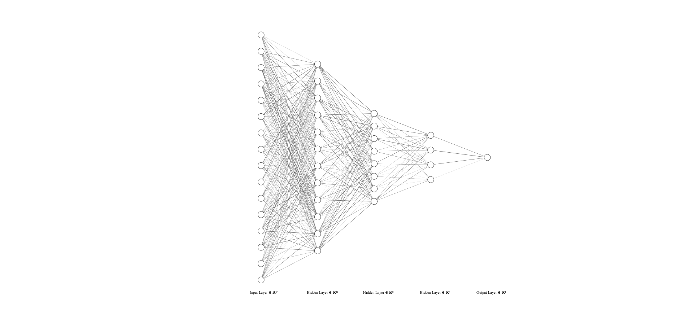
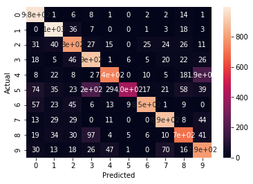

# Multi-Layer Perceptron (MLP) Neural Network (from Scratch)
##### Actually, it really is from scratch. I made this because the web is flooded with "from scratch" tutorials that use Keras, PyTorch, and SKLearn (_smh..._). That being said, `numpy` and `scipy` are used for computational purposes only. Hopefully, this repository can be helpful to someone.


<sup>Image generated via [NN SVG](http://alexlenail.me/NN-SVG/index.html).</sup>

## 🚀 Installation

Clone or download the repo and add it to your code. Please cite the author (Anthony Krivonos).

```
git clone https://github.com/anthonykrivonos/mlp.git
```

## 🛠 Usage

```
import * from neural_network.neural_network

...

nn = NeuralNetwork(input_size = 784)

# First activation and normalization layers
nn.add(Layer(512, Activation.sigmoid))
nn.add(RegLayer(Regularization.normalize))

# Second activation and normalization layers
nn.add(Layer(256, Activation.leaky_relu, 0.2))
nn.add(RegLayer(Regularization.normalize))

# Dropout layer
nn.add(RegLayer(Regularization.dropout, 0.3))

nn.add(Layer(output_size, Activation.softmax), verbose = True)

nn.train(X_train,
         y_train_encoded,
         batch_size = 1024,
         epochs = 10,
         verbose = True,
         shuffle = True,
         lr = 100,
         loss_type = Loss.cross_entropy,
         validation_split = 0.1,
         use_best_weights = True,
         dynamic_lr_rate = 0.8,
         dynamic_lr_limit= 10,
         dynamic_lr_epochs = 2)
```

Performance on [MNIST](http://yann.lecun.com/exdb/mnist/) dataset:



## 👁 See it in action...

- [... on the MNIST dataset.](tests/mnist.ipynb)

_(Note: we'd love for others to commit their successfully trained NN's to the tests/ directory.)_

## 🌟 Features

### Keras-like sequential layers

Add densely connected layers with ease and customize them to your heart's desire.

```
nn = NeuralNetwork(input_size = 40000)
nn.add(Layer(128, Activation.sigmoid))
nn.add(Layer(64, Activation.relu))
...
```

### Numerous activation and regularization implementations

#### Activation
- [Sigmoid](https://arxiv.org/pdf/1811.03378.pdf) [1]
- [RELU](https://arxiv.org/pdf/1811.03378.pdf) [1]
- [Leaky RELU](https://arxiv.org/pdf/1811.03378.pdf) [1]
- [RELU with Gaussian Noise](https://arxiv.org/pdf/1612.01490.pdf) [2]
- [ELU](https://arxiv.org/pdf/1811.03378.pdf) [1]
- Linear
- [Softmax](https://arxiv.org/pdf/1811.03378.pdf) [1]

##### Examples

```
layer_size = 8
nn.add(Layer(layer_size, Activation.sigmoid))
nn.add(Layer(layer_size, Activation.relu))
nn.add(Layer(layer_size, Activation.leaky_relu, 0.2)) # 0.2 is the leak
nn.add(Layer(layer_size, Activation.noisy_relu, 0.2)) # 0.2 is the Gaussian noise
nn.add(Layer(layer_size, Activation.elu, 0.2)) # 0.2 is the ELU coefficient
nn.add(Layer(layer_size, Activation.linear))
nn.add(Layer(layer_size, Activation.softmax))
```

#### Regularization
- L1 Regularization
- L2 Regularization
- [Dropout](http://jmlr.org/papers/volume15/srivastava14a/srivastava14a.pdf) [3]
- Normalization

##### Examples

```
nn.add(RegLayer(Regularization.l1, 0.4)) # 0.4 is the regularization lambda
nn.add(RegLayer(Regularization.l2, 0.4)) # 0.4 is the regularization lambda
nn.add(RegLayer(Regularization.dropout, 0.5)) # 0.5 is the dropout rate
nn.add(RegLayer(Regularization.normalize)) # 0.5 is the dropout rate
```

### Recall

Load weights with `nn.load_weights('filename')` and save weights `nn.save_weights('filename')`. Just ensure that the neural network retains its identical layer structure (for instance, you can't load a 128-input-size weight vector into a network that takes in an input size of 64).


## Inspiration

Basic feedforward and backpropogation algorithms inspired by Ali Mirzaei's [article on Medium](https://medium.com/@a.mirzaei69/implement-a-neural-network-from-scratch-with-python-numpy-backpropagation-e82b70caa9bb). [4]


## 📚 References

[1] Chigozie Nwankpa, et al. "Activation Functions: Comparison of trends in Practice and Research for Deep Learning." (2018).

[2] Yinan Li, et al. "Whiteout: Gaussian Adaptive Noise Regularization in Deep Neural Networks." (2016).

[3] Nitish Srivastava, et al. "Dropout: A Simple Way to Prevent Neural Networks from Overfitting". Journal of Machine Learning Research 15. 56(2014): 1929-1958.

[4] Ali Mirzaei. "Implement a neural network from scratch with Python/Numpy — Backpropagation". Medium. (2019).


## Author

Anthony Krivonos ([Portfolio](https://anthonykrivonos.com) | [LinkedIn](https://linkedin.com/in/anthonykrivonos))